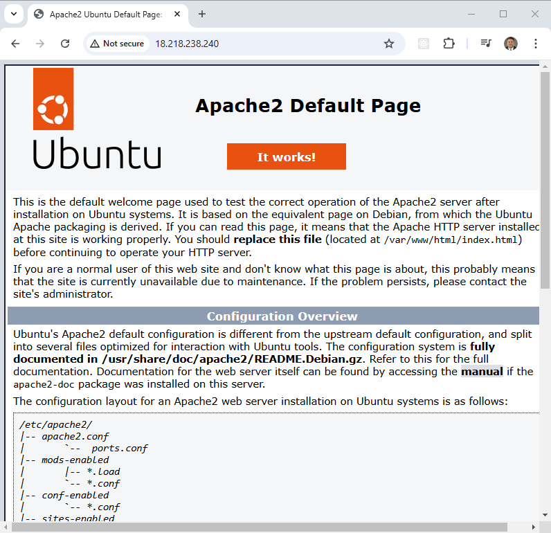

AWS Terraform Setup Instructions
=========================================

This project is a companion to a video done on my channel on how to configure terraform with AWS. 

The video for this project is [AWS + Terraform: Easy Setup](https://youtu.be/42ynVALwFk8).

The terraform in this project creates a minimal VPC with only one public subnet. 

An EC2 instance is created with Ubuntu as the OS with a [userdata](scripts/userdata.sh) script installing apache when the instance boots.

## Download this Repository

```bash
git clone https://github.com/mamonaco1973/aws-setup.git
cd aws-setup
```

## Prerequisites

* [Install AWS CLI](https://docs.aws.amazon.com/cli/latest/userguide/getting-started-install.html) 
* [Install Latest Terraform](https://developer.hashicorp.com/terraform/install)
* [Install Latest Packer](https://developer.hashicorp.com/packer/install)

NOTE: Make sure the aws, packer and terraform commands are all in your $PATH.

The [check_env](./check_env.sh) script will validate this is set correctly when you run the terraform build.

## AWS account

To run this example you need an AWS account. The [AWS Free Tier](https://aws.amazon.com/free/) will work fine for this example.

## Create access key and secret

### 1. Log in to the AWS Management Console
- Go to the [AWS Management Console](https://aws.amazon.com/console/).
- Ensure you are logged in with a user that has sufficient permissions to create access keys.

### 2. Navigate to the IAM Service
- In the AWS Management Console, search for **IAM** in the search bar and select it.

### 3. Create or Select an IAM User
- If you do not already have a user dedicated to Terraform, create one:
  1. **Click** on "Users" in the IAM console.
  2. **Click** on "Add users."
  3. Provide a **username** (e.g., `terraform-user`).
  4. Select **Access key - Programmatic access** under "Select AWS access type."
  5. Attach the appropriate **policies**:
     - To grant full access: Attach `AdministratorAccess` policy.
     - To limit access: Create a custom policy that grants permissions only to the resources Terraform will manage.
  6. Complete the process and note the new user details.

- If you already have a Terraform user, select it from the user list.

### 4. Generate the Access Key and Secret
1. In the IAM User settings, go to the **Security credentials** tab.
2. Scroll down to the **Access keys** section.
3. Click **Create access key**.
4. Select the purpose as **Programmatic Access**.
5. Download the `.csv` file or copy the **Access Key ID** and **Secret Access Key**. **You will not be able to view the secret again after this point.**

## Set the environment variables for your environment

### Bash Script
```bash
#!/bin/bash

# Set AWS access keys
export AWS_ACCESS_KEY_ID="your_access_key_id"
export AWS_SECRET_ACCESS_KEY="your_secret_access_key"
export AWS_DEFAULT_REGION="your_default_region"  # Recommended

# Verify settings
aws sts get-caller-identity
```

### PowerShell Script
```powershell
# Set AWS access keys
$env:AWS_ACCESS_KEY_ID = "your_access_key_id"
$env:AWS_SECRET_ACCESS_KEY = "your_secret_access_key"
$env:AWS_DEFAULT_REGION = "your_default_region"  # Recommended

# Verify settings
aws sts get-caller-identity
```
## Run the "apply" script

```bash
~/aws-setup$ ./apply.sh
NOTE: Validating that required commands are found in your PATH.
NOTE: aws is found in the current PATH.
NOTE: packer is found in the current PATH.
NOTE: terraform is found in the current PATH.
NOTE: All required commands are available.
NOTE: Checking AWS cli connection.
NOTE: Successfully logged into AWS.
Initializing the backend...
Initializing provider plugins...
- Reusing previous version of hashicorp/aws from the dependency lock file
- Using previously-installed hashicorp/aws v5.82.2

Terraform has been successfully initialized!

You may now begin working with Terraform. Try running "terraform plan" to see
any changes that are required for your infrastructure. All Terraform commands
should now work.

If you ever set or change modules or backend configuration for Terraform,
rerun this command to reinitialize your working directory. If you forget, other
commands will detect it and remind you to do so if necessary.
[...]
```

## Test the build

Once built a single EC2 instance called "`setup_ec2_instance`" will be created and will be publicly available. The output of the terraform will be the public IP address.

You can `SSH` to that instance with the "[Private_Key](keys\Private_Key)".

You can also open a web browser and see that apache has been deployed - This can take up to 5 minutes to initialize.



## Run the "destroy" script when you are done

```bash
~/aws-setup$ ./destroy.sh
Initializing the backend...
Initializing provider plugins...
- Reusing previous version of hashicorp/aws from the dependency lock file
- Using previously-installed hashicorp/aws v5.82.2

Terraform has been successfully initialized!

You may now begin working with Terraform. Try running "terraform plan" to see
any changes that are required for your infrastructure. All Terraform commands
should now work.

If you ever set or change modules or backend configuration for Terraform,
rerun this command to reinitialize your working directory. If you forget, other
commands will detect it and remind you to do so if necessary.
aws_vpc.setup_vpc: Refreshing state... [id=vpc-022bba406590c03a8]
aws_key_pair.setup_key_pair: Refreshing state... [id=setup-key-pair]
data.aws_ami.setup_ubuntu: Reading...
data.aws_ami.setup_ubuntu: Read complete after 0s [id=ami-009df4d14ea0846bf]
aws_internet_gateway.setup_igw: Refreshing state... [id=igw-0b7f2b08922651950]
aws_subnet.setup_public_subnet: Refreshing state... [id=subnet-040ff716242a8a925]
aws_security_group.setup_sg: Refreshing state... [id=sg-0b485688a42e3e91b]
aws_route_table.setup_route_table: Refreshing state... [id=rtb-05b73d434d68842bb]
aws_instance.setup_ec2_instance: Refreshing state... [id=i-0fb7689875d9cd074]
aws_route_table_association.setup_route_table_assoc: Refreshing state... [id=rtbassoc-0b4e6f78536b53d88]
[...]
```
