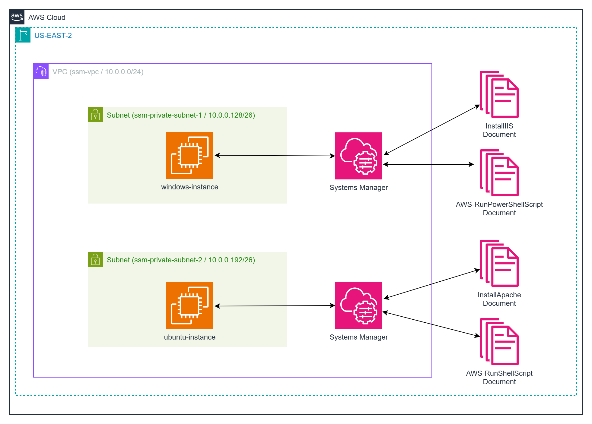

# Securely Managing EC2 Instances with AWS Systems Manager (SSM)

This project demonstrates how to securely access private Windows and Linux EC2 instances in AWS using **AWS Systems Manager (SSM)**. Unlike traditional bastion hosts or public IP access, SSM provides a **secure, agent-based, browser-accessible method** to manage EC2 instances without exposing them to the internet.

We’ll build a minimal, secure AWS environment with:

- A custom **VPC** with private subnets  
- A **private Windows Server EC2 instance**  
- A **private Ubuntu Server EC2 instance**  
- AWS **IAM roles** to grant SSM access  
- **Security Groups** scoped to minimum access  
- **SSM Session Manager** for browser-based remote access
- Two custom **SSM documents** for installing an HTTP server

All instances are deployed **without public IPs** and are managed through the AWS Console or CLI using Session Manager.



## Understanding AWS SSM Deployment

**AWS Systems Manager** allows you to remotely manage your EC2 instances using a lightweight agent. Session Manager enables shell or PowerShell access from the AWS Console, CLI, or SDK without opening any inbound ports or managing SSH keys.

### 1. **Create a Virtual Private Cloud (VPC)**

- The VPC is created with a CIDR block like `10.0.0.0/16`
- Two private subnets are created in different availability zones for the Windows and Ubuntu instances

### 2. **Provision Security Groups**

We define minimal security groups to enforce least privilege - port 443 needs to be open.

```hcl
resource "aws_security_group" "ec2_sg" {
  name        = "ssm-secure-sg"
  description = "Security group for EC2 instances without public access"
  vpc_id      = aws_vpc.main.id


  ingress {
    description = "Allow SSM from anywhere"           
    from_port   = 443                                 
    to_port     = 443                                 
    protocol    = "tcp"                              
    cidr_blocks = ["0.0.0.0/0"]                       
  }

  egress {
    from_port   = 0
    to_port     = 0
    protocol    = "-1"
    cidr_blocks = ["0.0.0.0/0"]
  }

  tags = {
    Name = "SSMInstanceSG"
  }
}
```

### 3. **Create IAM Role and Attach Policies**

Each instance is launched with an IAM role that allows it to communicate with SSM.

```hcl
resource "aws_iam_role" "ssm_role" {
  name = "SSMInstanceRole"

  assume_role_policy = jsonencode({
    Version = "2012-10-17"
    Statement = [{
      Effect = "Allow"
      Principal = {
        Service = "ec2.amazonaws.com"
      }
      Action = "sts:AssumeRole"
    }]
  })
}

resource "aws_iam_role_policy_attachment" "ssm_core" {
  role       = aws_iam_role.ssm_role.name
  policy_arn = "arn:aws:iam::aws:policy/AmazonSSMManagedInstanceCore"
}
```

### 4. **Launch EC2 Instances**

We deploy two EC2 instances using the appropriate SSM-compatible AMIs:

- **Ubuntu 24.04 LTS**
- **Windows Server 2022**

Each instance:

- Has **no public IP**
- Is launched in a **private subnet**
- Is attached to the `ssm_role` IAM role
- Has the SSM Agent installed and running

Example:

```hcl
resource "aws_instance" "ubuntu" {
  ami                         = data.aws_ami.ubuntu.id
  instance_type               = "t3.micro"
  subnet_id                   = aws_subnet.ubuntu_subnet.id
  vpc_security_group_ids      = [aws_security_group.ec2_sg.id]
  iam_instance_profile        = aws_iam_instance_profile.ssm_profile.name
  associate_public_ip_address = false

  tags = {
    Name = "Ubuntu-SSM"
  }
}
```

### 5. **Enable Session Manager**

Once deployed, instances automatically register with SSM if:

- The SSM Agent is installed (default on Amazon Linux, Ubuntu, and Windows AMIs)
- The IAM role is attached
- The instance has outbound internet access via NAT Gateway or VPC endpoints

You can now open a shell or PowerShell session:

```bash
aws ssm start-session --target i-xxxxxxxxxxxxxxxxx --region us-east-2
```

Or access via the **AWS Console → Systems Manager → Session Manager**.

---

## Prerequisites

- [AWS CLI Installed](https://docs.aws.amazon.com/cli/latest/userguide/install-cliv2.html)
- [Terraform Installed](https://developer.hashicorp.com/terraform/downloads)
- A valid AWS Account with permissions to create IAM, EC2, VPC, and SSM resources

Ensure your AWS credentials are exported or available via a configured profile.

---

## Download this Repository

```bash
git clone https://github.com/mamonaco1973/aws-ssm.git
cd aws-ssm
```

---

## Build the Code

```bash
azureuser@develop-vm:~/aws-ssm$ ./apply.sh
NOTE: Validating that required commands are found in your PATH.
NOTE: aws is found in the current PATH.
NOTE: jq is found in the current PATH.
NOTE: terraform is found in the current PATH.
NOTE: All required commands are available.
NOTE: Checking AWS cli connection.
NOTE: Successfully logged into AWS.
Initializing the backend...
Initializing provider plugins...
- Reusing previous version of hashicorp/aws from the dependency lock file
- Using previously-installed hashicorp/aws v5.100.0

Terraform has been successfully initialized!

You may now begin working with Terraform. Try running "terraform plan" to see
any changes that are required for your infrastructure. All Terraform commands
should now work.

If you ever set or change modules or backend configuration for Terraform,
rerun this command to reinitialize your working directory. If you forget, other
commands will detect it and remind you to do so if necessary.
data.aws_ami.windows_ami: Reading...
data.aws_ssm_parameter.ubuntu_24_04: Reading...
```

---

## Build Results

After applying the Terraform scripts, you'll see the following resources in your AWS account:

### 📁 VPC & Subnets

- A custom VPC with private subnets across two AZs
- No internet-facing public subnets

### 🔐 IAM Configuration

- IAM Role: `SSMInstanceRole`  
- IAM Instance Profile: `ssm_profile`  
- Attached Policy: `AmazonSSMManagedInstanceCore`

### 🖥️ EC2 Instances

- 1x Ubuntu Server 24.04 (private)
- 1x Windows Server 2022 (private)
- Both are SSM-enabled with no public IPs

### 🚪 Session Manager Access

- No SSH keys required
- No RDP exposure
- Access both instances via browser-based terminal or CLI using SSM

---

## SSM Demo

In the demo portion of the video, we show:

1. Navigating to the EC2 Dashboard to view running instances
2. Verifying that both instances have no public IP
3. Launching a session using **SSM Session Manager**
   - Bash session on Ubuntu
   - PowerShell session on Windows
4. Confirming secure agent-based communication
5. Reviewing VPC and IAM configurations
---

## SSM Documents for Bootstrapping

As part of this project, we define and use two custom **SSM Documents** to configure the EC2 instances immediately after provisioning:

### 1. **InstallApacheOnUbuntu**

This document installs Apache on the Ubuntu instance and deploys a simple web page.

```json
{
  "schemaVersion": "2.2",
  "description": "Install Apache and Hello World page on Ubuntu",
  "mainSteps": [{
    "action": "aws:runShellScript",
    "name": "installApache",
    "inputs": {
      "runCommand": [
        "sudo apt update",
        "sudo apt install -y apache2",
        "echo 'Hello from Ubuntu via SSM!' | sudo tee /var/www/html/index.html",
        "sudo systemctl enable apache2",
        "sudo systemctl start apache2"
      ]
    }
  }]
}
```

### 2. **InstallIIS**

This document installs IIS on the Windows instance and configures a basic site.

```json
{
  "schemaVersion": "2.2",
  "description": "Install IIS and Hello World page on Windows",
  "mainSteps": [{
    "action": "aws:runPowerShellScript",
    "name": "installIIS",
    "inputs": {
      "runCommand": [
        "Install-WindowsFeature -Name Web-Server",
        "Add-Content -Path 'C:\inetpub\wwwroot\index.html' -Value 'Hello from Windows via SSM!'"
      ]
    }
  }]
}
```

These documents are registered using Terraform and then invoked programmatically or via CLI:

```bash
aws ssm send-command   --document-name "InstallApacheOnUbuntu"   --targets "Key=tag:Name,Values=ubuntu-instance"   --comment "Install Apache via SSM"
```

```bash
aws ssm send-command   --document-name "InstallIISHelloWorld"   --targets "Key=tag:Name,Values=windows-instance"   --comment "Install IIS via SSM"
```

This allows hands-off configuration of instances **immediately after launch**, making the instances production-ready without manual intervention.

